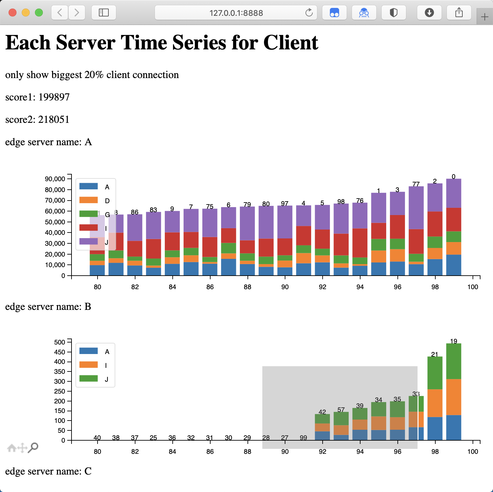

# CodeCraft2022-benchmark - 华为CodeCraft2022 判题器  
A benchmark for Huawei CodeCraft 2022  
华为CodeCraft2022 判题器 及 GUI




This benchmark requires numpy, mpld3, matplotlib   
该判题器需要使用numpy, mpld3, matplotlib

```bash
python3 -m pip install -r requirement.txt
```

Now, this benchmark support **web GUI**.  
该判题器如今支持**网页可视化**。  

Please put this benchmark at the same level with `build_and_run.sh`.  
请将本判题器放在和`build_and_run.sh`文件相同层级下。  

Usage: 用法
```bash 
python3 benchmark.py [your_execution_command]
```

Some file is necessary, `./data/*` and `./output/solution.txt`. (well, it will also search at `/data/*` and `/output/solution.txt`).  
一些文件是必要的，`./data/*` and `./output/solution.txt`. (当然，本判题器也会搜索 `/data/*` and `/output/solution.txt`).  

The argument is optional. if not provided, this benbchmark will automatically execute `sh build_and_run.sh`.  
参数是可选项。如果不提供，则将会使用默认的`sh build_and_run.sh`命令用于编译和判题。  

You can specify your execution command, e.g. `python3 benchmark.py java -jar xx.jar`. It will also works according to the file in `output/`, even the execution command does not work.  
你可以指定你的执行命令，例如，你可以这样使用 `python3 benchmark.py java -jar xx.jar` 。即使用于执行代码的命令无法运行，本判题器依然能根据`output/`中的文件判断你的分数。

Score is only for reference. Because the data we used online and offline is different, I can not sure the truth of this benchmark.  
分数仅供参考。因为线上线下使用的数据不同，因此我无法保证判题器分数的真实性。

This benchmark only tested on macOS, I cannot sure it will work on other system. This benchmark may have many bug, only for test usage.   
该判题器仅在macOS下测试过，我无法保证它能兼容其他系统，可能存在很多bug，仅做测试用途。

# Warning 警告
Please don't use the code in your version of submission, it's **code plagiarism**, and Huawei will **disqualify** us because we used the same code.  
请勿在你提交的版本中使用本仓库的代码，这属于代码**剽窃**，而且华为在复查时会因为相同的代码而判定我们**失去资格**。

# Pressure Test 压力测试数据
Now, pressure test data is available at [here](https://github.com/diphosphane/CodeCraft2022-PressureGenerator).  
压测数据生成器可以在[这里](https://github.com/diphosphane/CodeCraft2022-PressureGenerator)下载到。  

If you can pass the test, but can not pass the online test, then it would be the problem of your program, you can try to generate pressure test data, then use the data that can not pass to debug.  
如果你可以通过判题器的测试，但却无法通过线上测试，那么你可以尝试着使用压测程序生成数据，使用无法通过测试的数据进行debug。  

# Wechat Reward 微信打赏  
If you find this tool helpful, please consider buy me a cup of coffee.  
如果你觉得该工具有用，可以考虑打赏一杯咖啡。  
